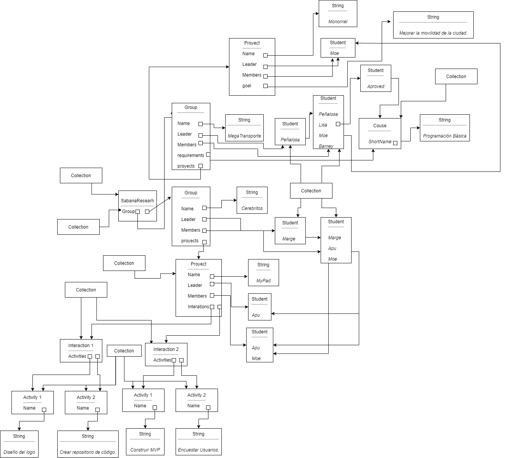
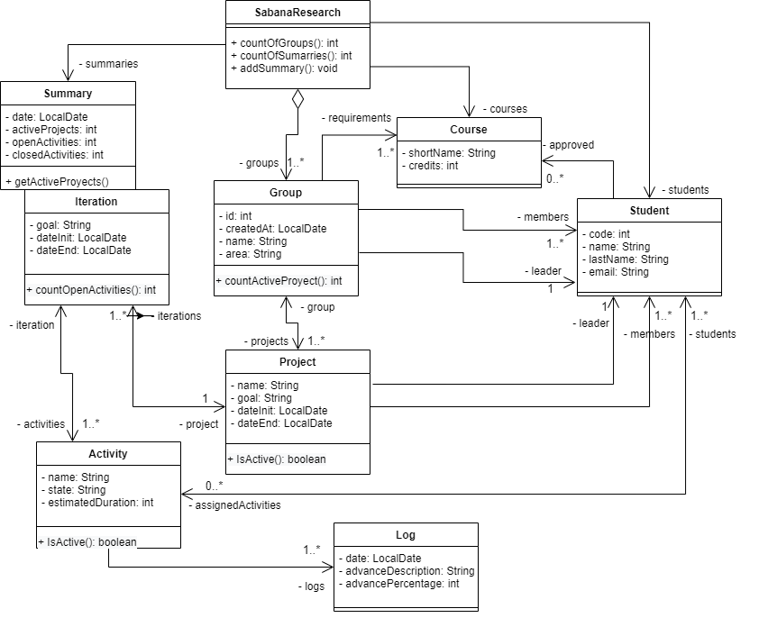
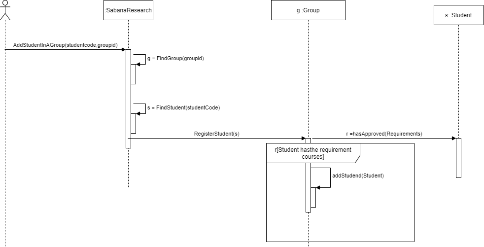

 # POOB-TEST-FIRST-SABANA-RESEARCH

 ## Diego Alejandro Prado Prieto

 ## Diagrama de Memoria

 

 ## Diagrama UML

 

 ## Diseño
 

 ### Conceptos

 ¿Qué es encapsulamiento? ¿Qué ventajas ofrece?

  Encapsulamiento es el ocultamiento de datos de un objeto de manera que solo se pueda cambiar mediante las operaciones definidas para ese objeto.

  Esto permite ocultar informacion a las otras clases, y solo mostrar lo que el sistema requiera sin dar la información de un objeto a todo mundo

 ¿Qué es ocultación de información? ¿Por qué aplicarla? ¿Cómo se implementa en Java?

 La ocultación de iformacion es el encasulamiento mencionado anteriomente, se aplica para resguadar los datos de un objeto, se implementa mediante la definicion de los atrivitos del objetos, ya sea con el private, que se encarga qeu solo la clase pueda tener acceso a la información, y public que permite a cualquier clase quetenga una instancia del objeto pueda acceder a esta información.
